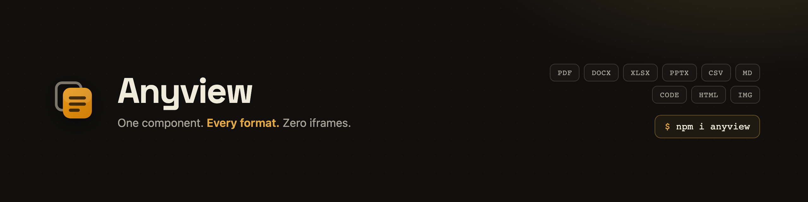
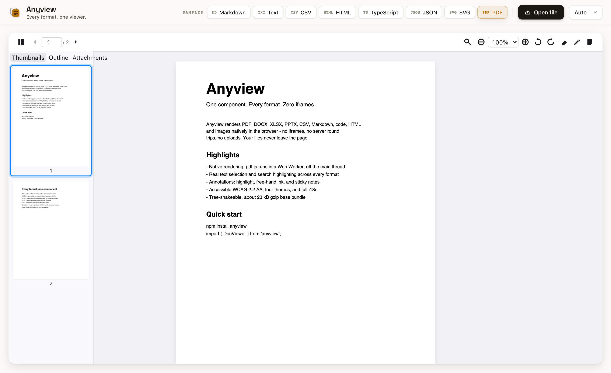

<div align="center">



# Anyview

### One component. Every format. Zero iframes.

The universal document viewer for React. It renders **PDF, DOCX, XLSX, PPTX, CSV, Markdown, code, HTML, Jupyter notebooks & images** natively in the browser. No iframes, no server round-trips, no uploads. Your files never leave the page.

[](https://www.npmjs.com/package/anyview)
[](./LICENSE)
[](https://bundlephobia.com/package/anyview)
[](https://github.com/harshpreet931/anyview/actions)
[](https://github.com/harshpreet931/anyview)

**[▶ Live demo](https://harshpreet931.github.io/anyview/)** &nbsp;·&nbsp; [Quick start](#quick-start) &nbsp;·&nbsp; [Why Anyview?](#why-anyview) &nbsp;·&nbsp; [FAQ](#faq)

<br />


<br /><br />



<sub>A real document rendered in the <a href="https://harshpreet931.github.io/anyview/">live playground</a>, with a selectable text layer, cross-format search, thumbnails, and annotations.</sub>

</div>

---

> **Status:** `v0.2`, published on npm (`npm i anyview`), pre-1.0 and actively evolving. The flagship PDF experience (native render, text selection, search highlighting, 8 annotation tools) is implemented; reflowable formats (DOCX, XLSX, PPTX, CSV, Markdown, code, HTML, Jupyter notebooks) render, are searchable, and have page thumbnails. Full zoom UX (wheel / pinch / marquee / fit modes), two-page spread, a drag-drop empty state, and a rich imperative + callback API round it out. Try it via the [playground](#run-the-playground).

## Why Anyview?

Every other React document viewer either **uses iframes** (slow, insecure, leaks your files to Microsoft/Google's online viewers, can't render private/auth-gated documents) or **supports only one format** (PDF-only, image-only). Anyview renders **everything natively in the browser**, with no iframes, no server-side conversion, and no clunky embeds. Private files stay client-side.

| Feature | Anyview | @cyntler/react-doc-viewer | react-pdf | react-file-viewer |
|---|:---:|:---:|:---:|:---:|
| PDF | ✅ Native (pdf.js worker) | ✅ iframe | ✅ | ✅ |
| DOCX | ✅ Native (mammoth.js) | ❌ iframe | ❌ | ✅ iframe |
| XLSX | ✅ Native (SheetJS) | ❌ iframe | ❌ | ✅ iframe |
| PPTX | ✅ Native (JSZip + XML) | ❌ | ❌ | ❌ |
| CSV/TSV | ✅ Native (PapaParse) | ❌ | ❌ | ✅ |
| Markdown | ✅ Native (react-markdown) | ❌ | ❌ | ✅ |
| Code (50+ langs) | ✅ Native (Shiki) | ❌ | ❌ | ❌ |
| HTML | ✅ Sanitized (DOMPurify) | ✅ iframe | ❌ | ✅ iframe |
| Jupyter (`.ipynb`) | ✅ Native | ❌ | ❌ | ❌ |
| Images (8 formats) | ✅ Native | ✅ | ❌ | ✅ |
| Private files (no upload) | ✅ | ❌ public URL only | ✅ | ❌ |
| Text selection | ✅ | partial | ✅ | ❌ |
| Search + highlight | ✅ all formats | ❌ | ✅ PDF | ❌ |
| Annotations | ✅ 8 tools (PDF) | ❌ | ❌ | ❌ |
| Zoom (wheel/pinch/marquee/fit) | ✅ | ❌ | partial | ❌ |
| Two-page spread | ✅ | ❌ | ❌ | ❌ |
| **No iframes** | ✅ | ❌ | ✅ | ❌ |
| **Web Workers** | ✅ Off-main-thread | ❌ | ✅ | ❌ |
| **Tree-shakeable** | ✅ Load only what you need | ❌ | ✅ | ❌ |
| **WCAG 2.2 AA** | ✅ Built-in | ❌ | ❌ | ❌ |
| **Bundle size** | **~23 kB gzip** (base) | ~40 kB | ~50 kB | ~100 kB |

## Quick Start

```bash
npm install anyview
```

Anyview keeps format parsers as **optional peer dependencies** so you ship only what you use. Add the parser for each format you need:

```bash
npm install pdfjs-dist                  # PDF
npm install mammoth                     # DOCX
npm install xlsx                        # XLSX
npm install jszip                       # PPTX
npm install papaparse                   # CSV/TSV
npm install react-markdown remark-gfm   # Markdown
npm install shiki                       # code highlighting
npm install dompurify                   # HTML / DOCX sanitization
```

> Jupyter notebooks (`.ipynb`) reuse the Markdown, code, and sanitizer parsers above, so they need no extra dependency.

```tsx
import { DocViewer } from 'anyview';
import 'anyview/styles';

function App() {
  return (
    <DocViewer
      source={{ kind: 'url', url: '/files/report.pdf' }}
      theme="auto"
      showToolbar
      showSidebar
      onDocumentLoad={(doc) => console.log(`${doc.pageCount} pages`)}
    />
  );
}
```

`source` accepts a `File`, a URL, a raw `ArrayBuffer`, or a `FileSystemFileHandle`:

```tsx
<DocViewer source={{ kind: 'file', file }} />
<DocViewer source={{ kind: 'buffer', buffer, name: 'a.docx', type: '' }} />
```

## Headline features

- **Native rendering, zero iframes.** PDF rasterizes off the main thread in a Web Worker (OffscreenCanvas → `ImageBitmap`), while Office, text, and notebook formats parse to real DOM.
- **Real text selection.** Select and copy text directly off PDF pages via an aligned, invisible text layer over the bitmap; reflowable formats select natively.
- **Search with highlighting.** `Cmd/Ctrl+F` finds matches across **every text format**, paints highlight overlays, distinguishes the active match, and scrolls it into view. PDF uses the text layer; DOCX, XLSX, PPTX, Markdown, code, HTML, CSV, and notebooks use the CSS Custom Highlight API over real DOM text.
- **Full zoom & layout.** Ctrl/Cmd+wheel and two-finger **pinch** zoom (anchored at the cursor), **marquee** zoom-to-selection, **fit-page / fit-width / actual-size** modes, and a **two-page / book-spread** layout.
- **Annotations, 8 tools.** Highlight, free-hand ink, sticky note, **rectangle, ellipse, line, arrow, and free-text** on PDF pages. Geometry is normalized so they survive zoom. Create, read, update, and delete them, **export/import as versioned sidecar JSON** through the imperative ref, and observe changes with `onAnnotationChange`.
- **Jupyter notebooks.** Open `.ipynb` files natively: markdown cells, syntax-highlighted code, and saved outputs (text, images, HTML/SVG, error tracebacks). No kernel, no Python, no upload.
- **Drop-in file opening.** The empty state is a working dropzone, so you can click to browse or drop a file to open it.
- **Events & control.** Rich callbacks (`onPageChange`, `onZoom`, `onSearchResult`, `onVisiblePagesChange`, `onSelectionChange`, `onAnnotationChange`) plus a controlled `page` prop.
- **Virtualized.** Only visible pages (± overscan) are in the DOM, and a byte-budgeted LRU cache keeps rendered bitmaps under a 256 MB ceiling.
- **Accessible, themeable & SSR-ready.** ARIA roles, keyboard nav, forced-colors and reduced-motion support, four themes (`light` / `dark` / `auto` / `sepia`), full i18n via the `locale` prop, and Next.js App Router support (ships `'use client'`, SSR-safe).

## Supported Formats

| Format | Engine | Worker | Text select | Search | Outline | Annotations |
|---|---|:---:|:---:|:---:|:---:|:---:|
| PDF | pdf.js | ✅ | ✅ | ✅ | ✅ | ✅ |
| DOCX | mammoth.js | Planned | ✅ | ✅ | ✅ | - |
| XLSX | SheetJS | Planned | ✅ | ✅ | ✅ | - |
| PPTX | JSZip + XML | Planned | ✅ | ✅ | ✅ | - |
| CSV/TSV | PapaParse | Planned | ✅ | ✅ | - | - |
| Markdown | react-markdown + remark-gfm | - | ✅ | ✅ | ✅ | - |
| Code (50+) | Shiki | - | ✅ | ✅ | - | - |
| HTML | DOMPurify | - | ✅ | ✅ | ✅ | - |
| Jupyter (`.ipynb`) | react-markdown + Shiki | - | ✅ | ✅ | ✅ | - |
| Images (8) | Native browser | - | - | - | - | - |
| Plain Text | Native | - | ✅ | ✅ | - | - |

> "Worker: Planned" means the format currently parses on the main thread; the architecture supports moving it to a worker without API changes.

## Run the playground

```bash
pnpm install
pnpm --filter anyview-playground dev
```

Drag any PDF / DOCX / XLSX / PPTX / CSV / Markdown / code / HTML / `.ipynb` / image onto the page. It renders entirely client-side; nothing is uploaded.

## Architecture

```
┌─────────────────────────────────────────────────┐
│                   DocViewer                       │
│  ┌─────────┐  ┌──────────┐  ┌─────────────────┐  │
│  │ Toolbar │  │ Sidebar  │  │  Viewer         │  │
│  │ (zoom,  │  │ (thumbs, │  │  (virtualized   │  │
│  │  search,│  │  outline,│  │  page list +    │  │
│  │  annot) │  │  attach) │  │  text/search/   │  │
│  └─────────┘  └──────────┘  │  annot layers)  │  │
│                             └─────────────────┘  │
│              ┌─────────────────┐                  │
│              │  Zustand Store  │                  │
│              │  (6 slices)     │                  │
│              └────────┬────────┘                  │
│              ┌────────┴────────┐                  │
│              │ Adapter Registry│ (fresh instance  │
│              │  (plugin arch)  │  per document)   │
│              └────────┬────────┘                  │
│     ┌──────────┬──────┴───┬──────────┐            │
│     ▼          ▼          ▼          ▼            │
│  ┌─────┐   ┌─────┐    ┌─────┐    ┌─────┐          │
│  │ PDF │   │DOCX │    │XLSX │    │ ... │          │
│  │worker│  │     │    │     │    │     │          │
│  └─────┘   └─────┘    └─────┘    └─────┘          │
│  pdfjs-dist  mammoth   xlsx       ...             │
│  (dynamic import, never in the base bundle)       │
└─────────────────────────────────────────────────┘
```

### Key design decisions

- **Plugin architecture.** Each format is a self-contained adapter with a static manifest (loaded synchronously, so the toolbar knows capabilities before any parser loads) and a lazy loader (dynamic `import()` only when a matching file opens). The registry constructs a **fresh adapter instance per document**, so multiple viewers never share state.
- **Worker-offloaded.** PDF parsing and rendering run in a Web Worker via Comlink, so the main thread never blocks.
- **Byte-budgeted LRU cache.** Rendered page bitmaps are cached under a 256 MB budget with automatic eviction and memory-pressure shrinking.
- **WCAG 2.2 AA.** ARIA roles, keyboard navigation, screen-reader announcements, forced-colors, and reduced-motion support, built in.
- **~23 kB gzip base.** Only Zustand + Comlink + @tanstack/react-virtual ship in the base; format engines load on demand as separate chunks.

## Advanced Usage

### Custom adapter

Adapters are loaded as **classes**: the module's default export is a constructor the registry instantiates per document.

```tsx
import { DocViewer, createRegistry, registerBuiltInAdapters } from 'anyview';

const registry = createRegistry();
registerBuiltInAdapters(registry);

registry.register(
  {
    id: 'epub',
    label: 'EPUB Book',
    extensions: ['epub'],
    mimeTypes: ['application/epub+zip'],
    icon: '<svg>…</svg>',
    features: { search: true, annotations: false, textSelection: true, /* … */ },
    priority: 100,
    protocolVersion: 1,
  },
  () => import('./adapters/epub'), // default-exports the EpubAdapter class
);

function App() {
  return <DocViewer source={source} registry={registry} />;
}
```

### Imperative API

```tsx
const ref = useRef<DocViewerRef>(null);

ref.current?.goToPage(5);
ref.current?.zoomIn();
ref.current?.search({ text: 'invoice', caseSensitive: false, wholeWord: false, regex: false, diacritics: false });
ref.current?.nextMatch();
await ref.current?.print();

// Programmatic annotations for review / markup flows:
ref.current?.setActiveTool('rectangle');
ref.current?.addAnnotation(annotation);
const sidecar = ref.current?.exportAnnotations();   // { version: 1, annotations: [...] }
ref.current?.importAnnotations(sidecar);            // a sidecar object or its JSON string
```

### Events & controlled props

```tsx
<DocViewer
  source={source}
  page={page}                                  // controlled: drives the current page
  onPageChange={(page, total) => setPage(page)}
  onZoom={(zoom, fitMode) => {}}
  onSearchResult={(result) => {}}
  onVisiblePagesChange={(pages) => {}}          // e.g. lazy-load thumbnails
  onSelectionChange={({ text, pageIndex }) => {}}
/>
```

### Annotations

Eight tools are available: **highlight, ink, sticky note, rectangle, ellipse, line, arrow, and free-text**. Geometry is normalized so annotations survive zoom. Persist them as versioned sidecar JSON, or drive them through the [imperative API](#imperative-api) (`addAnnotation` / `setAnnotations` / `exportAnnotations` / `importAnnotations`).

```tsx
import { serializeAnnotations, parseAnnotations } from 'anyview';

<DocViewer
  source={source}
  onAnnotationChange={(annotations) => localStorage.setItem('notes', serializeAnnotations(annotations))}
/>
```

### Hooks & i18n

```tsx
import { useNavigation, I18nProvider, registerStrings } from 'anyview';

function PageIndicator() {
  const { currentPage, totalPages } = useNavigation();
  return <span>{currentPage + 1} / {totalPages}</span>;
}

// Localize: register a strings table, then pass locale="fr"
registerStrings('fr', frenchStrings);
<DocViewer source={source} locale="fr" />
```

## Theming

```css
.my-app .dv-root {
  --dv-toolbar-height: 40px;
  --dv-progress-bar-color: #e63946;
  --dv-sidebar-width: 240px;
}
```

Four built-in themes: `light`, `dark`, `auto` (follows system), `sepia`.

## Browser Support

| Feature | Chrome 90+ | Firefox 88+ | Safari 15+ | Edge 90+ |
|---|:---:|:---:|:---:|:---:|
| Core viewer | ✅ | ✅ | ✅ | ✅ |
| Web Workers / OffscreenCanvas | ✅ | ✅ | 17+ | ✅ |
| CSS Custom Highlight (DOM search) | ✅ | ✅ | 17.2+ | ✅ |
| File System Access | ✅ | - | - | ✅ |

Missing features degrade gracefully. For example, rendering falls back to a main-thread canvas without OffscreenCanvas, and search still counts and navigates matches where the Custom Highlight API is unavailable.

## Development

```bash
pnpm install
pnpm lint        # eslint
pnpm typecheck   # tsc --noEmit
pnpm test        # vitest
pnpm build       # vite library build
```

## FAQ

**How do I view a DOCX / XLSX / PPTX file in React without an iframe?**
Use Anyview. It renders Office formats **natively in the browser** (DOCX via mammoth.js, XLSX via SheetJS, PPTX via JSZip), so there is no iframe and no Microsoft/Google Online viewer involved:

```tsx
import { DocViewer } from 'anyview';
import 'anyview/styles';

<DocViewer source={{ kind: 'file', file }} />   // a File from an <input>, drag-drop, etc.
```

**Can it render private or local files (not just public URLs)?**
Yes. Everything runs client-side, so private, authenticated, and local files work and **nothing is ever uploaded**. This is the main difference from iframe-based viewers like `@cyntler/react-doc-viewer` / `react-doc-viewer`, which render Office files through the Microsoft Office Online service and therefore **require publicly accessible URLs** and send your documents to a third party.

**How do I render any document type in React with one component?**
`<DocViewer source={…} />` auto-detects the format from the file name / MIME type and loads the matching renderer on demand: PDF, DOCX, XLSX, PPTX, CSV, Markdown, code, HTML, Jupyter notebooks, and images, all from one component.

**Is there a free, open-source alternative to PSPDFKit / Nutrient / Apryse for viewing Office documents in React?**
Yes. Anyview is MIT-licensed and free. It renders PDF and Office formats natively (no server, no license key) with text selection, cross-format search, and PDF annotations.

**Which packages do I need to install?**
Just `anyview` plus the parser for each format you actually use (they're optional peer dependencies): `pdfjs-dist` for PDF, `mammoth` for DOCX, `xlsx` for XLSX, `jszip` for PPTX, `papaparse` for CSV, `react-markdown` + `remark-gfm` for Markdown, `shiki` for code, `dompurify` for HTML. You ship only what you use.

**Does it work with Next.js / Vite / CRA?**
Yes. It's a standard React component (React 18+). For SSR frameworks like Next.js, render it client-side (the parsers use browser APIs and a Web Worker).

## Contributing

Contributions are welcome! See [CONTRIBUTING.md](./CONTRIBUTING.md).

## License

MIT
